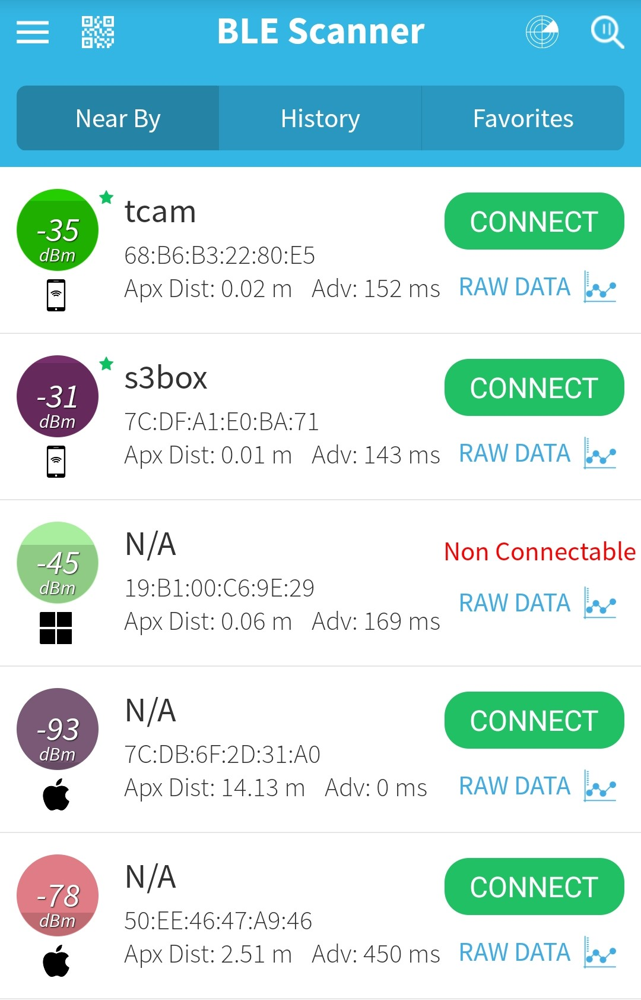

# BLE Advertiser

BLE Advertiser for simulating ESP32 devices as a BLE tag. We proposed to use mobile phones however, as mobile phone have dynamic BLE MAC addresses currently and difficult to find MAC with current BLE scanners. We used ESP32 devices as a tag.

Used **PlatformIO** extension from VS Code and **<Arduino.h>**. Also used **NimBLE** library.

You may change the name of the tag inside ***main.cpp***.
```c++
    NimBLEDevice::init("");
```
with maximum of 6 characters.

After which we can be able to scan the addresses of the programmed tags with **BLE Scanner** with your devices.

