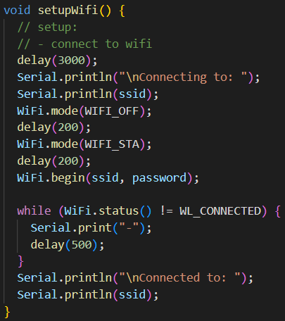
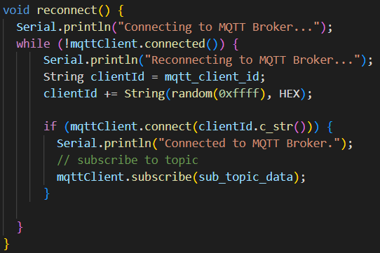
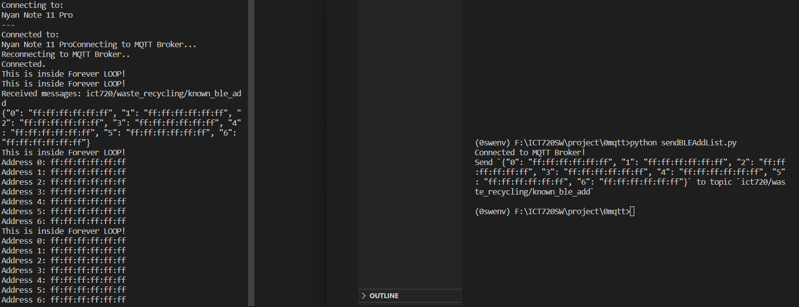
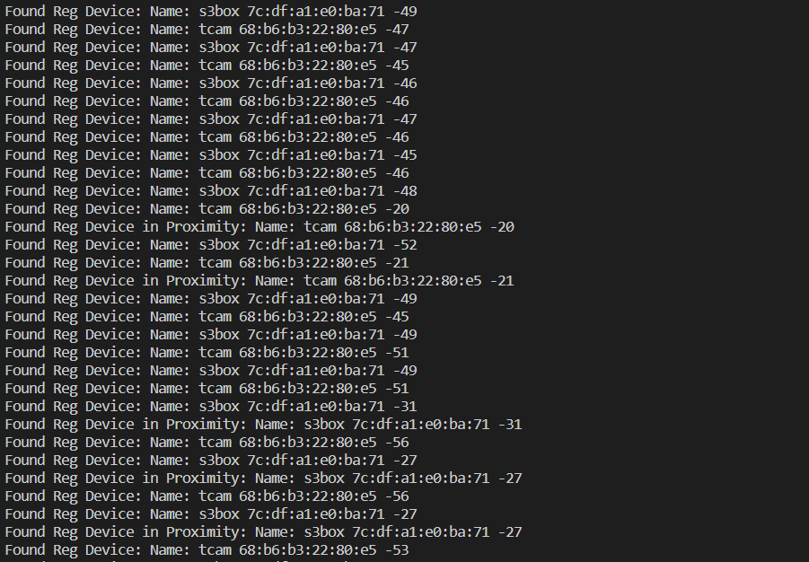
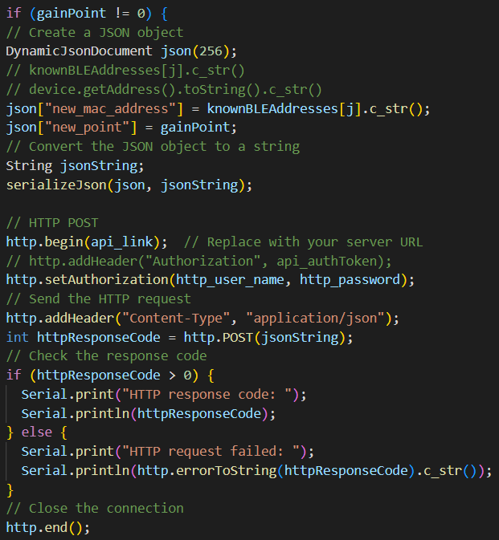
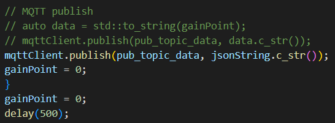
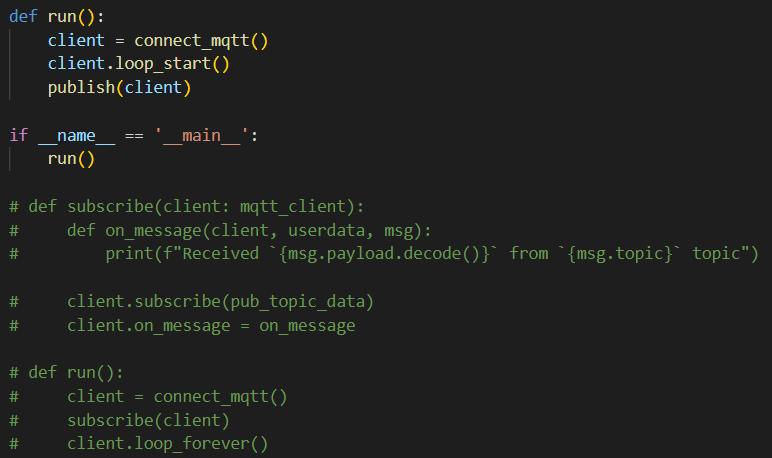
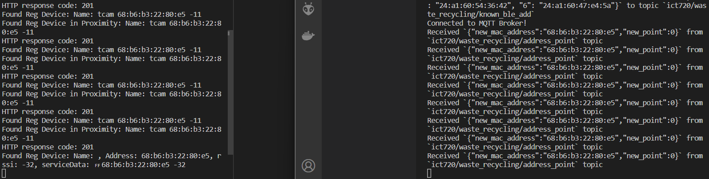

# Everything Combined

This is the combination of every modules.

First this code will try to connect to WiFi

and then will try to connect to MQTT broker.

Then the server will send MQTT data every time there is an update in MAC address list. The received MQTT list will be saved in string array.

Found BLE addresses will be compared with the string array and if the RSSI is closed enough,

the code will wait for the serial data from the Object Detection Model to send the **POINTS** and **MAC Address** to the database with HTTP POST.

You may also use MQTT as an Publisher the code for the ESP32 and also for the server side is included in the repository.

MQTT Subscribe for server side.

The result of the request and subscription on server side.
