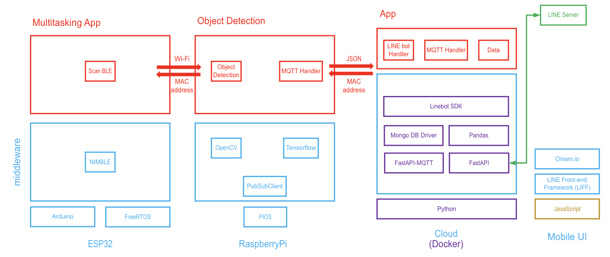

# Recycling Rewards: A Point-based Reward System with Recycling Incentives for Smart and Green Campus
## ICT720 project

## Group 1
### Project brief

### Objectives
1. To implement **a trash segragation system** with an object detection camera
2. To create a database for the **point-based reward system** for different users
3. To build a **web interface** for reward & exchange system

## User stories and acceptance criteria
1. As a **Student Affair Unit**, we want to **know which student threw trash properly** so that **we can reward that student**.
   * Scenario: **Point Reward**, given **student is in the database**, when **student threw bottles in the bottle bin**, then **POINTS will be rewarded & notified**.
   * Scenario: **Point Deduction**, given **student is in the database**, when **student threw other types of trash into both of the bins**, then **POINTS will be deducted & notified**.

2. As a **Student Affair Unit**, we want to **know how many points the students received** so that **we can give a proper reward to the students & notify the students immediately**.
   * Scenario: **Reward Notification**, given **student threw the trash**, when **they threw the trash**, then **the POINTS are notified**.
   * Scenario: **Reward Given**, given **students have enough POINTS**, when **they came to cash out**, then **the reward is given**.
   
     | POINTS      | Baht        |
     | ----------- | ----------- |
     | 5 POINTS    | 1 THB       |
     | 50 POINTS   | 10 THB      |
     | 500 POINTS  | 100 THB     |
     
   * For example, given **students have 50 POINTS**, when **they came to cash out**, then **1 bottle of water is given**.
   * Scenario: **Cashed Out**, given **students have cashed out**, when **the reward is given**, then **the POINTS will be used**.
   
3. As a **student**, I want to **see how many POINTS I have collected** so that **I can decide to cash out**. I want to **exchange POINTS** with my friends.
   * Scenario: **individual POINTS query**, given **he/she is in the database**, when **POINTS are queried**, then **POINTS of that student is responsed**.
   * Scenario: **POINTS Transfer**, given **student A transfers POINTS to student B's account**, when **POINTS are transfered**, then **student A's POINTS will be transfered & reduced**.
   * Scenario: **POINTS Receive**, given **student A transfers POINTS to student B's account**, when **POINTS are received**, then **student B will receive POINTS & POINTS will be added**.

## Impacts of the project
By proceeding this project, we can acquire the following impacts:
   1. Reduction in littering: By rewarding student for throwing trash in designated bins, the reward point system can motivate individuals to dispose of waste properly,while preventing pollution. 
   3. Increased recycling rates: The reward point system can encourage student to separate recyclable materials from non-recyclable waste, leading to an increase in recycling rates.
   4. Reduced waste generation: As student become more conscious of the environmental impact of waste, they may reduce their overall waste generation, leading to a reduction in the amount of waste that ends up in landfills or incinerators.
   5. Environmental conservation: Proper waste management conserves natural resources and prevents pollution, while a reward point system for throwing trash fosters community ownership and responsibility.
   6. Economic benefits:  Proper waste management can also create economic benefits by reducing costs associated with waste disposal, promoting resource conservation, and generating revenue through recycling and waste-to-energy initiatives.

## Software architecture and behaviors
### US1 tag&object_detection
Software system consists of three software stacks for **BLE scanner & RaspberryPi**, **tag collector & object detector**, and **mobile UI**.

For the hardware sequence diagram, the **BLE scanner will scan MAC addresses**, the **RaspberryPiCamera will detect objects**, and **MQTT will send MAC addresses and corresponding POINTS** to the server.

For the software sequence diagram, the **Web app scans the student's phone MAC address**, **Requests an account creation with it on the cloud server**, and **Validates the student's data in the database**, then **Responds the request step by step** to the student.

### Web Application

The implementation of this system involves several components, such as web architecture, web services, APIs, and MQTT brokers. 
1. **System Requirements**
   * Web Server: pythonanywhere (https://softwaregroup1.pythonanywhere.com)
   * Database Server: Sqlite3
   * Web Framework: Django version 4.1.7
   * Front-end Framework: Bootstrap5, JavaScript ES6
   * Supported Browsers: Google Chrome, Mozilla Firefox, and Microsoft Edge to ensure compatibility.
   
 
   
2. **Web Architecture**
   We uses a three-tier architecture consisting of the following components:
   * Presentation Layer: The front-end user interface, built using a front-end framework to provide a responsive and interactive experience.
   * Application Layer: The server-side logic responsible for processing user requests, managing data, and interacting with external services. This layer is built  
     using a web development framework that is Django.
   * Data Layer: The database server that stores all the necessary data, such as staff activities,student information, recycling data, and reward points.
   
 

3. **Web Services**
   * API (Application Programming Interface): DjangoRESTful APIs are used to enable communication between the front-end and back-end systems. These APIs facilitate 
     data exchange in a standardized format (usually JSON) and allow for easy integration of third-party services.
   * MQTT Broker: An MQTT broker is used to manage the real-time communication between IoT devices (e.g., recycling bins) and the web application. The broker receives 
     data from the devices and publishes it to the appropriate topics, enabling the web application to consume and process the data efficiently.
     
  

### Members
1. Limhourlaurent Meam (limhourlaurent.meam@dome.tu.ac.th)
2. Wetu Vexo (m6522040622@g.SIIT.tu.ac.th)
3. Aeint Shune Thar (aeint.shu@dome.tu.ac.th)
4. Khin Thandar Kyaw (khinthandar.k@live.ku.th)
5. Nyan Lin Mya (m6522040523@g.siit.tu.ac.th)
6. Hrang Kap Lian (hrangkap.l@live.ku.th)

### Hardware

1. [ESP32-S3-Box](https://github.com/espressif/esp-box) (Espressif ESP32-S3-Box)
   * USB serial
   * LCD 240x320: ILI9342C
   * [6-axis IMU ICM-42607-P](https://invensense.tdk.com/products/motion-tracking/6-axis/icm-42670-p/)
2. [LILYGO T-Display-S3](https://github.com/Xinyuan-LilyGO/T-Display-S3) (Espressif ESP32-S3-DevKitC-1)
   * USB serial
   * LCD 170x320
3. [LILYGO T-Camera S3](https://www.lilygo.cc/products/t-camera-s3) (Espressif ESP32-S3-DevKitC-1)
   * USB serial
   * OV2640 camera module
   * OLED 128x64
4. [LILYGO T-Dongle S3](https://github.com/Xinyuan-LilyGO/T-Dongle-S3) (Espressif ESP32-S3-DevKitC-1)
   * USB serial
   * LCD 80x160
5. [LILYGO T-PicoC3](https://github.com/Xinyuan-LilyGO/T-PicoC3) (Espressif ESP32-C3-DevKitM-1)
   * Dual-processor with RP2040
   * LED 135x240

## Scope
1. Concepts: 
   * Lectures: L1(AIoT architecture), L2(software models), L3(), L4(), L5(), L6(), L7(), L8(), L9(), L10()
   * Practices: P1(cross-platform development/Bluetooth Low Energy), P2(multi-threading application), P3(), P4(), P6(), P7(), P8(), P9(), P10().
2. Skills:
   * Lectures: L1(user story), L2(UML diagram), L3(), L4(), L5(), L6(), L7(), L8(), L9(), L10().
   * Practices: P1(embedded programming/BLE programming), P2(state machine coding/RTOS programming), P3(), P4(), P6(), P7(), P8(), P9(), P10().
3. Tools: GitHub, VS Code, Platform.io, HiveMQ, 
4. Case study: MarTech using BLE beacon.

)
